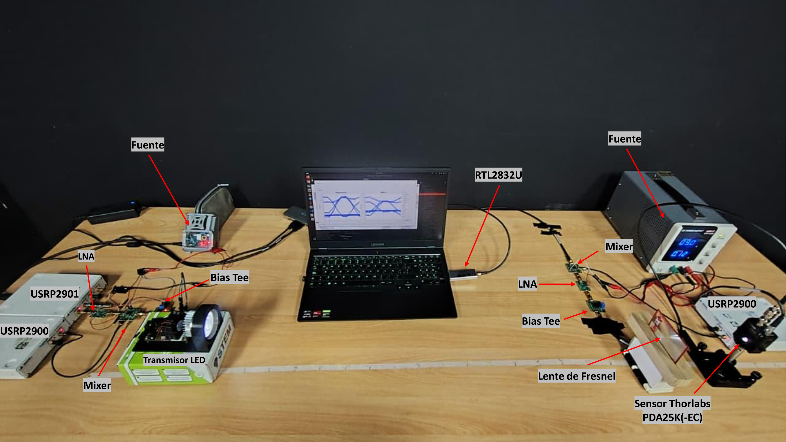
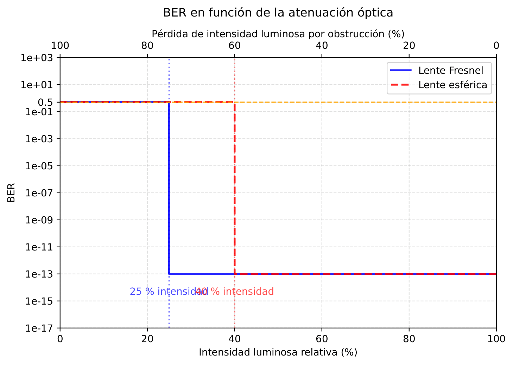
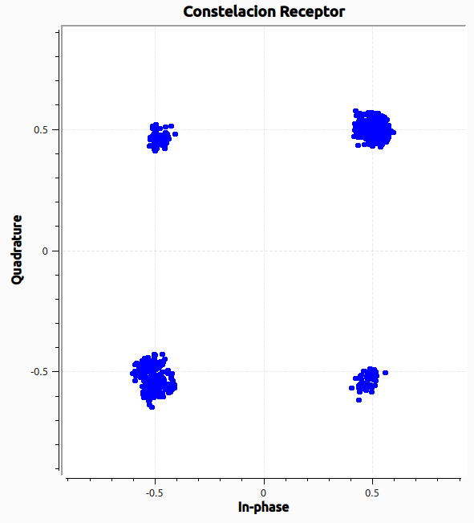
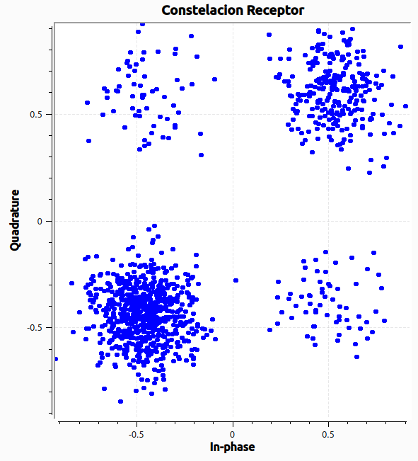
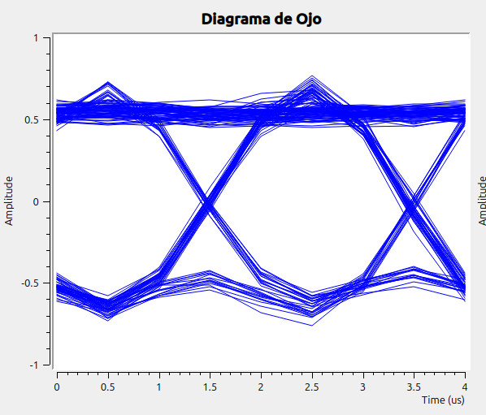
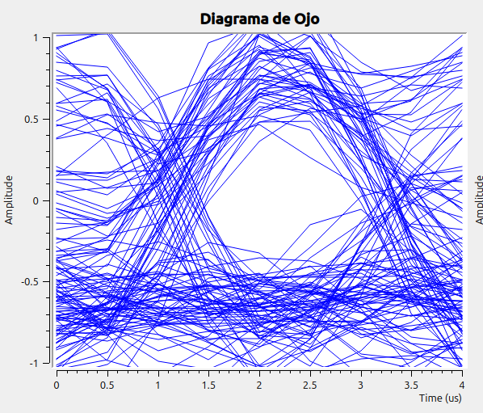

# Estudio de BER de un enlace híbrido RF–VLC

## 1. Motivación y contexto

El indicador principal de desempeño del sistema es la **SNR**, validada estadísticamente.
Sin embargo, la señal de FM retransmitida es analógica (esquema IM/DD), por lo que **no
permite por sí sola medir una tasa de error de bit**. Para caracterizar el BER del enlace óptico fue necesario complementar el montaje con una **cadena de modulación digital QPSK, con un patrón de bits conocido y demodulación sincronizada**.

---

## 2. ¿Por qué QPSK y por qué esta cadena de medida?

Se eligió **QPSK** por su eficiencia espectral y porque permite evaluar el canal con una
constelación robusta y bien conocida. La señal QPSK se expresa como:

$$
s_{QPSK}(t) = \sum_k \Big[ a_0(k)\,p(t-kT_s)\sqrt{2}\cos(\omega_0 t) - a_1(k)\,p(t-kT_s)\sqrt{2}\sin(\omega_0 t) \Big]
$$

equivalentemente $s_{QPSK}(t) = \sum_k A\,p(t-kT_s)\cos(\omega_0 t + \theta_k)$, con
$A = \sqrt{2}\sqrt{a_0^2(k)+a_1^2(k)}$ y $\theta_k = \tan^{-1}\!\big(a_1(k)/a_0(k)\big)$.

La definición de BER empleada es la clásica:

$$
\mathrm{BER} = \frac{N_{err}}{N_{tot}}
$$

donde $N_{err}$ es el número de bits erróneos y $N_{tot}$ el total de bits comparados.

### El problema de medir BER bajo SDR

Como toda la cadena se implementó sobre **radio definida por software (GNU Radio)**, **no
fue viable una comparación bit a bit directa** contra la secuencia transmitida. La gestión
que el sistema operativo hace de los periféricos introduce:

- *buffers* que pueden inicializarse con datos residuales,
- latencias variables de las interfaces USB,
- arranque **no sincronizado** entre las USRP y el RTL-SDR,

lo que provoca derivas y pérdidas de secuencia que rompen la correspondencia uno-a-uno entre
bits transmitidos y recibidos. Ante la ausencia de un medidor de BER dedicado, la solución
fue construir una cadena **auto-sincronizante**:

| Elemento | Rol en la medida de BER |
|----------|--------------------------|
| **GLFSR** (registro de desplazamiento realimentado) | Genera el patrón de bits conocido (PRBS). |
| **Codificador convolucional CCSDS R=1/2, K=7** + **Viterbi** | Protege la secuencia y corrige errores de canal. |
| **Recuperador de reloj (Gardner)** | Sincroniza el muestreo de símbolo entre relojes independientes. |
| **Lazo de Costas (orden 4)** | Recupera portadora y corrige el *frequency offset*. |
| **Scrambler / Descrambler auto-sincronizante** | Recupera la **alineación** de la secuencia sin copia de referencia: la fracción de "unos" a su salida es proporcional al BER. |

Esta filosofía permite **sostener una recepción confiable y estimar el BER** sin alinear
manualmente las secuencias, eludiendo las limitaciones del paradigma SDR.

---

## 3. Montaje experimental

*Montaje experimental, medida BER.*

La evaluación usa el **USRP** del laboratorio como transmisor y el **RTL2832U** como receptor,
bajo las mismas condiciones de señal del resto del trabajo.  

- **Modulación:** QPSK, RRC con factor de caída $\alpha = 1$, **4 muestras por símbolo**,
  tasa de **500 kBaud/s**, portadora RF de **140 MHz**.
- **Recepción:** heterodinaje con **frecuencia intermedia de 500 kHz**, filtrado de DC
  (DC-Blocker), sincronización por Gardner, recuperación de portadora con lazo de Costas de
  orden 4, decodificación Viterbi del código CCSDS.
- **Distancia Tx–Rx:** banco de pruebas con separación máxima de **≈ 135 cm** (distancia
  típica en pruebas experimentales de VLC).

Para valorar la calidad de la señal recuperada se emplean **tres indicadores complementarios**:
la **tasa de error de bit**, la **constelación recibida** (dispersión de los símbolos respecto
a sus posiciones ideales) y el **diagrama de ojo** (capacidad de resolver la señal frente a
las variaciones de fase y amplitud introducidas por el ruido).

---

## 4. Procedimiento de medida

Se transmite la secuencia binaria pseudoaleatoria (GLFSR) y se mide el BER **a distancia
fija**, reduciendo de forma **controlada** la intensidad luminosa incidente sobre el receptor
mediante un **obstáculo rectangular** que bloquea progresivamente el haz. Así se barre la
variable de interés —la **intensidad luminosa relativa** que llega al fotodetector— mientras
todo lo demás permanece constante.

El BER mínimo configurado en la medición es **10⁻¹³** (valor "piso" cuando el enlace es
perfecto), implementado en el flujograma con la suma de `1e-13` antes del `log10` para evitar
la singularidad `log10(0)`.

---

## 5. Resultados

### 5.1 BER en función de la atenuación óptica

*Medida del BER general en función de la intensidad luminosa recibida.*

La curva muestra un **comportamiento de umbral abrupto**:

- Mientras la intensidad recibida es **suficiente**, el BER permanece en su mínimo configurado
  (**10⁻¹³**): el enlace recupera la secuencia prácticamente sin errores.
- Al reducir la intensidad hasta **≈ 25 %** (lente de Fresnel) o **≈ 40 %** (lente esférica),
  el BER **se dispara de forma brusca hasta ≈ 0.5**, es decir, una salida prácticamente
  **aleatoria**.

**¿Por qué el cambio es tan brusco?** Mientras hay luz suficiente, el lazo de Costas y el
sincronizador de símbolo (Gardner) **mantienen enganchada la fase** aunque la constelación
luzca ruidosa. Cuando la intensidad cae al umbral, los símbolos se dispersan y empiezan a
sobrepasar los umbrales de decisión: el algoritmo de Gardner y el lazo de Costas **pierden
el enganche**, la constelación comienza a **girar**, y el enlace pasa de cero errores a una
salida aleatoria (BER ≈ 0.5). Este umbral define experimentalmente el **punto de operación**
del enlace óptico.

> La gráfica fue generada con [`graficaBER.py`](graficaBER.py): un eje X inferior con la
> intensidad luminosa relativa (%) y un eje X superior con la pérdida por obstrucción (%),
> con escala logarítmica en el BER y los umbrales del 25 % (Fresnel) y 40 % (esférica)
> marcados.

### 5.2 Constelación recibida

| Sin obstrucción de la luz | Con ≈ 25 % de intensidad lumínica |
|:--:|:--:|
|  |  |

*Constelaciones QPSK recuperadas en el receptor.*

Sin obstrucción, los símbolos aparecen **bien definidos y agrupados** en torno a los cuatro
puntos de la constelación QPSK. Al reducir la intensidad luminosa al 25 %, los puntos **se
dispersan**, evidenciando mayor incertidumbre en la detección y, por tanto, un incremento
del BER.

### 5.3 Diagrama de ojo

| Sin obstrucción de la luz | Con ≈ 25 % de intensidad lumínica |
|:--:|:--:|
|  |  |

*Diagrama de ojo de la señal recibida.*

Sin obstrucción, la **apertura del ojo es amplia**: buen margen de amplitud frente al ruido
y baja probabilidad de error. Al caer la intensidad al 25 %, el **ojo se cierra y aumenta el
jitter**, en concordancia con el deterioro de la constelación y el aumento del BER.

---

## 6. Conclusiones del estudio BER

- El experimento **confirma experimentalmente el umbral de operación del enlace óptico** y
  complementa las métricas de SNR del sistema híbrido.
- La cadena auto-sincronizante (GLFSR + CCSDS/Viterbi + Gardner + Costas + descrambler)
  permite **estimar el BER bajo SDR** pese a la imposibilidad de comparación bit a bit directa.
- El paso brusco de BER (de 10⁻¹³ a ≈ 0.5) en torno al 25 % de intensidad es un fenómeno de
  **pérdida de enganche de los lazos de sincronización**, no una degradación gradual del canal.
- Los hallazgos sobre SNR —validados con Shapiro–Wilk + Kruskal–Wallis ($p<0.001$)— siguen
  siendo la evidencia técnica concluyente sobre la mejora de la arquitectura híbrida; el
  análisis de BER **aporta el umbral de operación** y se proyecta como base de una futura
  publicación científica.

---

## 7. Mapa de archivos

| Archivo | Contenido |
|---------|-----------|
| [`BER.grc`](BER.grc) | Flujograma de GNU Radio Companion del transceptor QPSK con medida de BER. |
| `MontajeRFVLC-BER.pdf` | Montaje experimental de la medida de BER. |
| [`graficaBER.py`](graficaBER.py) / `graficaBER.png` | Script y gráfica BER vs. intensidad luminosa. |
| `constelacionNormal.png` / `constelacionAL25.png` | Constelaciones QPSK sin/con obstrucción. |
| `diagramadeojoNomal.png` / `DiagramadeojoAL25.png` | Diagramas de ojo sin/con obstrucción. |

---

## 8. Parámetros clave (resumen)

- **Modulación:** QPSK (2 bits/símbolo), RRC $\alpha = 1$, `sps = 4`.
- **Tasa de símbolo:** 500 kBaud → tasa de muestreo RF 2 MS/s.
- **FEC:** convolucional CCSDS **R = 1/2, K = 7** + Viterbi (decisión suave).
- **Portadora de datos:** 140 MHz (Tx) / off-tuning 500 kHz (Rx); FI = 500 kHz.
- **Hardware:** USRP (Tx) + RTL2832U/osmocom (Rx); LED blanco + ThorLabs PDA25K(-EC) + lente de Fresnel.
- **Variable de barrido:** intensidad luminosa relativa (%) mediante obstrucción controlada.
- **Umbral de operación:** BER salta de 10⁻¹³ a ≈ 0.5 al caer la luz al ≈ 25 % (Fresnel) / 40 % (esférica).
