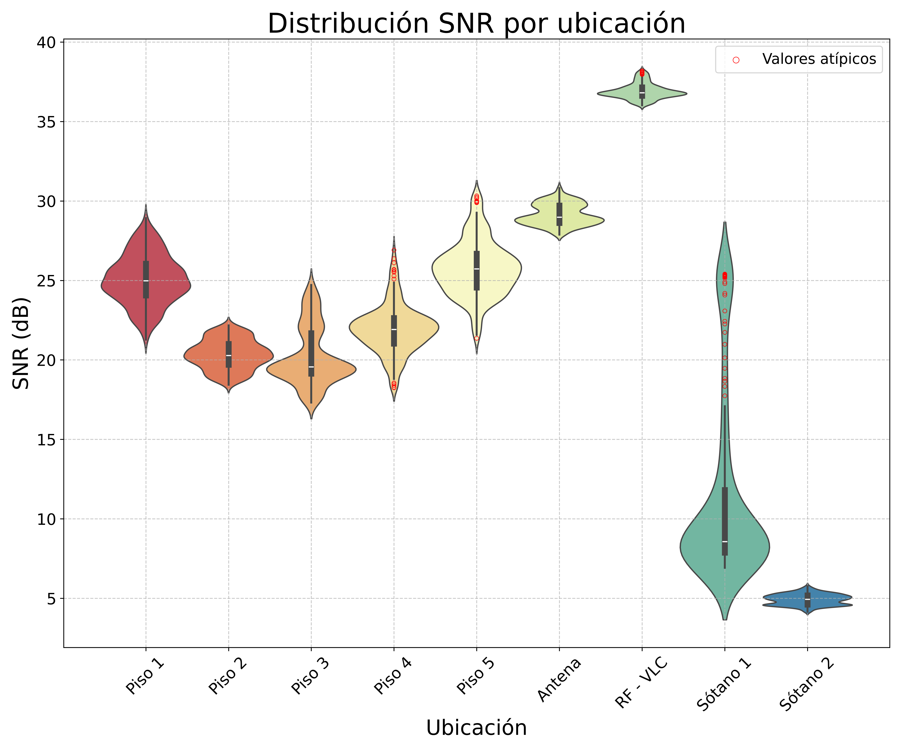
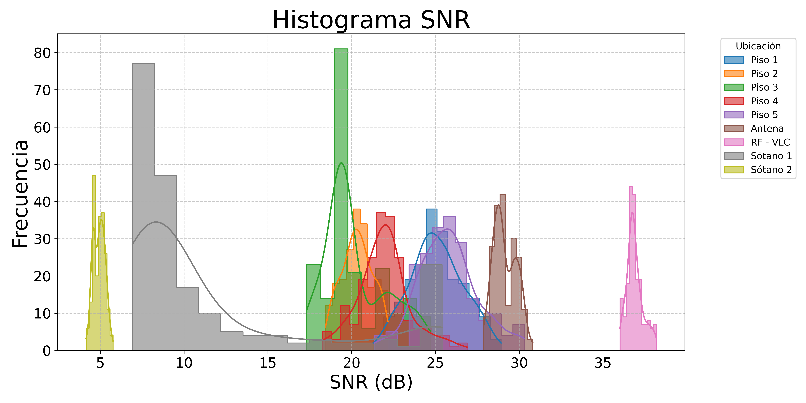
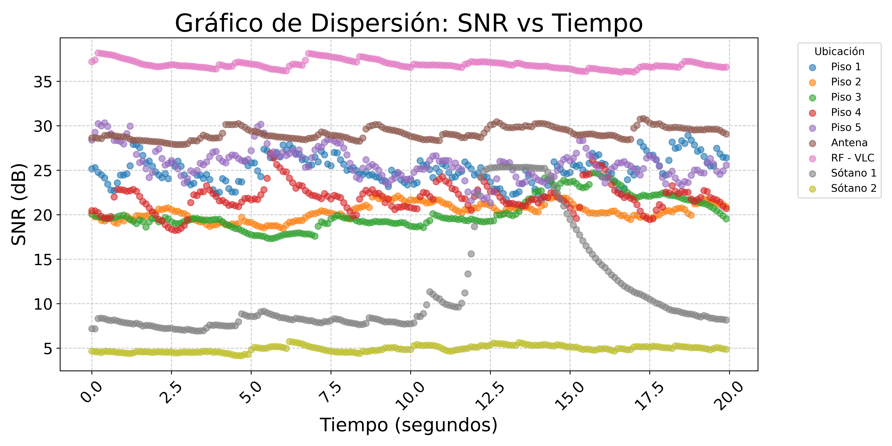
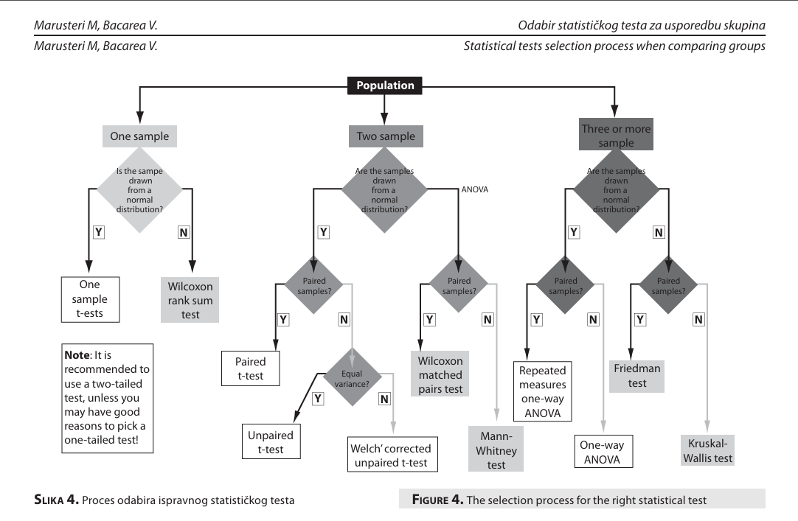
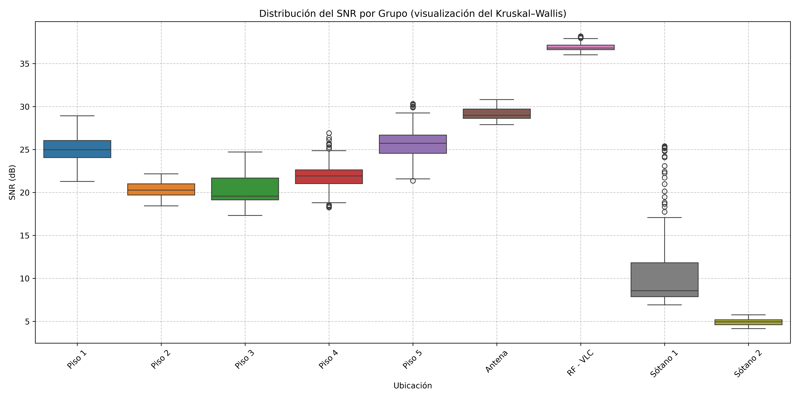

# Estudio Estadístico de la Degradación SNR

Notebook didáctico que reproduce el flujo de `main.py` y desarrolla en detalle el análisis estadístico que respalda la **Tabla 4.1** del manuscrito de tesis.

> [!NOTE]
> Todos los bloques de código de este README están pensados para **pegarse en celdas de un Jupyter Notebook** (o en Google Colab) y ejecutarse en orden, de arriba hacia abajo. El notebook original ([SNRDegradationStudy.ipynb](SNRDegradationStudy.ipynb)) ya viene con esta misma secuencia.

## Alcance del estudio

- Carga directa de los **9 archivos** del estudio desde el repositorio público (no requiere clonar).
- Visualizaciones (violín, histograma, scatter) y tabla de estadísticas descriptivas con glosario didáctico de cada columna.
- Análisis inferencial: prueba de **normalidad (Shapiro–Wilk)** y prueba de **comparación entre grupos (Kruskal–Wallis)**, con explicación detallada de las hipótesis nulas y su interpretación.
- Justificación bibliográfica de la cadena estadística usando el árbol de decisión de **Marusteri & Bacarea (2010)**.

> [!TIP]
> Todas las figuras se guardan en [`Study_images/`](Study_images/) (PNG y PDF a 600 dpi) y la tabla de estadísticas se exporta como [`statistics.csv`](Study_images/statistics.csv).

---

## 0. Instalación de dependencias

> [!NOTE]
> En Colab la mayoría ya están preinstaladas; este bloque garantiza versiones compatibles.

```bash
!pip install -q pandas numpy matplotlib seaborn scipy scikit-learn openpyxl
```

---

## 1. Imports y carpeta de salida `Study_images/`

```python
import os
import numpy as np
import pandas as pd
import matplotlib.pyplot as plt
import seaborn as sns
from scipy import stats
from scipy.stats import kruskal
from sklearn.preprocessing import RobustScaler

# Carpeta donde se guardarán todas las figuras y la tabla de estadísticas
images_path = os.path.join(os.getcwd(), 'Study_images')
os.makedirs(images_path, exist_ok=True)
print(f'Carpeta de salida: {images_path}')
```

---

## 2. Carga de datos desde GitHub

Los **9 archivos** del estudio se leen directamente desde la rama `main` del repositorio `SNR-Lab` mediante URLs `raw`, por lo que el notebook funciona en Colab sin clonar el repositorio.

> [!IMPORTANT]
> **Alcance:** los 9 escenarios reportados son **Antena Yagi (Piso 4 outdoor)**, **Pisos 1–5**, **Sótanos 1 y 2**, y banco **RF–VLC**. La antena Yagi se ubica en la zona al aire libre del Piso 4 (no en la terraza del 6º piso), elegida deliberadamente porque está justo encima de los sótanos, lo que permite tender un cable vertical hasta Sótano 2 emulando un trayecto outdoor → indoor profundo.

```python
# URL base del repositorio (carpeta Data/ en GitHub)
base_url = 'https://raw.githubusercontent.com/Navarrojuan212/SNR-Lab/main/Data/'

# Archivos a cargar (los 9 escenarios de la Tabla 4.1)
file_names = [
    'Piso1_103_5MHz_SNR.xlsx',
    'Piso2_103_5MHz_SNR.xlsx',
    'Piso3_103_5MHz_SNR.xlsx',
    'Piso4_103_5MHz_SNR.xlsx',
    'Piso5_103_5MHz_SNR.xlsx',
    'AntennaOutdoor_103_5MHz_SNR.xlsx',
    'RF-VLC_SNR.xlsx',
    'Sotano1_103_5MHz_SNR_B.csv',
    'Sotano2_103_5MHz_SNR_E.csv'
]

# Traducción a nombres amigables (replica main.py)
def translate_name(file_name):
    mapping = {
        'Piso1_103_5MHz_SNR.xlsx': 'Piso 1',
        'Piso2_103_5MHz_SNR.xlsx': 'Piso 2',
        'Piso3_103_5MHz_SNR.xlsx': 'Piso 3',
        'Piso4_103_5MHz_SNR.xlsx': 'Piso 4',
        'Piso5_103_5MHz_SNR.xlsx': 'Piso 5',
        'AntennaOutdoor_103_5MHz_SNR.xlsx': 'Antena',
        'RF-VLC_SNR.xlsx': 'RF - VLC',
        'Sotano1_103_5MHz_SNR_B.csv': 'Sótano 1',
        'Sotano2_103_5MHz_SNR_E.csv': 'Sótano 2'
    }
    return mapping.get(file_name, 'Unknown Source')

# Lectura de CSV o Excel según extensión
def load_data(file_url):
    if file_url.endswith('.csv'):
        return pd.read_csv(file_url)
    elif file_url.endswith('.xlsx'):
        return pd.read_excel(file_url, engine='openpyxl')
    else:
        raise ValueError(f'Unsupported file type: {file_url}')
```

```python
# Cargar todos los archivos en un diccionario de DataFrames
data_frames = {}
for file_name in file_names:
    file_url = base_url + file_name
    try:
        df = load_data(file_url)
        df['Source'] = translate_name(file_name)             # Nombre amigable
        df['Time_Index'] = np.arange(0, len(df) * 0.1, 0.1)  # Eje temporal sintético (0.1 s)
        data_frames[file_name] = df
        print(f'Loaded {file_name} -> {len(df)} filas')
    except Exception as e:
        print(f'Error al procesar {file_name}: {e}')
```

```python
# Verificación de tamaños y construcción del DataFrame combinado
for file_name, df in data_frames.items():
    print(f'{translate_name(file_name)}: {len(df)} filas')

combined_df = pd.concat(data_frames.values(), ignore_index=True)
print('\nForma de combined_df:', combined_df.shape)
combined_df.head()
```

> [!NOTE]
> Cada escenario aporta **200 filas**, totalizando **1.800 muestras** de SNR en el `combined_df` final.

---

## 3. Violin Plot por ubicación

Distribución de SNR por ubicación con boxplot interno y outliers (regla 1.5·IQR) marcados en rojo.

```python
# Outliers por grupo usando IQR
def calculate_outliers(data, group_column, value_column):
    grouped_outliers = {}
    for group_name, group_data in data.groupby(group_column):
        q1 = group_data[value_column].quantile(0.25)
        q3 = group_data[value_column].quantile(0.75)
        iqr = q3 - q1
        lower_bound = q1 - 1.5 * iqr
        upper_bound = q3 + 1.5 * iqr
        outliers = group_data[(group_data[value_column] < lower_bound) | (group_data[value_column] > upper_bound)]
        grouped_outliers[group_name] = outliers[value_column]
    return grouped_outliers

def create_violin_plot(combined_df, images_path):
    plt.figure(figsize=(12, 10))
    unique_sources = combined_df['Source'].unique()
    palette = sns.color_palette('Spectral', len(unique_sources))
    sns.violinplot(
        data=combined_df,
        x='Source',
        y='SNR',
        palette=palette,
        inner='box',
        width=1.8,
        gap=0.4,
        bw_adjust=0.8,
    )

    outliers = calculate_outliers(combined_df, 'Source', 'SNR')
    for source, outlier_values in outliers.items():
        x_position = list(unique_sources).index(source)
        plt.scatter(
            [x_position] * len(outlier_values),
            outlier_values,
            color='red',
            facecolors='none',
            linewidths=0.5,
            s=15,
            zorder=3,
            label='Valores atípicos' if source == list(outliers.keys())[0] else ''
        )

    plt.legend(loc='upper right', fontsize=14, scatterpoints=1, markerscale=1.5)
    plt.title('Distribución SNR por ubicación', fontsize=26)
    plt.xlabel('Ubicación', fontsize=20)
    plt.ylabel('SNR (dB)', fontsize=20)
    plt.yticks(fontsize=15)
    plt.xticks(rotation=45, fontsize=15)
    plt.grid(True, linestyle='--', alpha=0.7)
    plt.tight_layout()
    plt.savefig(os.path.join(images_path, 'violin_plotIET.pdf'), format='pdf', dpi=600, transparent=True)
    plt.savefig(os.path.join(images_path, 'violin_plotIET.png'), format='png', dpi=600, transparent=True)
    plt.show()

create_violin_plot(combined_df, images_path)
```



---

## 4. Histograma SNR

Histograma con KDE para todas las ubicaciones superpuestas.

```python
def create_histogram(data_frames, images_path, translate_name):
    plt.figure(figsize=(12, 6))
    for file_name, df in data_frames.items():
        translated_name = translate_name(file_name)
        sns.histplot(df['SNR'], kde=True, element='step', label=translated_name, alpha=0.6)
    plt.title('Histograma SNR', fontsize=26)
    plt.xlabel('SNR (dB)', fontsize=20)
    plt.ylabel('Frecuencia', fontsize=22)
    plt.tick_params(axis='both', which='major', labelsize=15)
    plt.legend(title='Ubicación', bbox_to_anchor=(1.05, 1), loc='upper left')
    plt.grid(True, linestyle='--', alpha=0.7)
    plt.tight_layout()
    plt.savefig(os.path.join(images_path, 'histogramIET.pdf'), format='pdf', dpi=600, transparent=True)
    plt.savefig(os.path.join(images_path, 'histogramIET.png'), format='png', dpi=600, transparent=True)
    plt.show()

create_histogram(data_frames, images_path, translate_name)
```



---

## 5. Scatter SNR vs Tiempo

Evolución temporal del SNR (índice sintético cada 0.1 s) por ubicación.

```python
def create_scatterplot(data_frames, images_path, translate_name):
    plt.figure(figsize=(12, 6))
    for file_name, df in data_frames.items():
        translated_name = translate_name(file_name)
        plt.scatter(df['Time_Index'], df['SNR'], label=translated_name, alpha=0.6)
    plt.title('Gráfico de Dispersión: SNR vs Tiempo', fontsize=24)
    plt.xlabel('Tiempo (segundos)', fontsize=18)
    plt.ylabel('SNR (dB)', fontsize=18)
    plt.tick_params(axis='both', which='major', labelsize=15)
    plt.legend(title='Ubicación', bbox_to_anchor=(1.05, 1), loc='upper left')
    plt.xticks(rotation=45)
    plt.grid(True, linestyle='--', alpha=0.7)
    plt.tight_layout()
    plt.savefig(os.path.join(images_path, 'scatterplotIET.pdf'), format='pdf', dpi=600, transparent=True)
    plt.savefig(os.path.join(images_path, 'scatterplotIET.png'), format='png', dpi=600, transparent=True)
    plt.show()

create_scatterplot(data_frames, images_path, translate_name)
```



---

## 6. Estadísticas descriptivas por ubicación

Para cada uno de los 9 escenarios calculamos un conjunto de **estadísticos descriptivos** del SNR. Cada fila de la tabla corresponde a un escenario y cada columna a un estadístico distinto.

### ¿Qué buscamos en estos números?

Los descriptores se agrupan en dos familias:

- **Tendencia central** (¿dónde "viven" los datos?): media $\bar{x}$, mediana $\tilde{x}$, moda $\hat{x}$.
- **Dispersión** (¿qué tan estables son?): cuartiles $Q_1, Q_3$, IQR, varianza $\sigma^2$, desviación estándar $\sigma$, fronteras de outliers.

> [!TIP]
> Cuando $\bar{x} \neq \tilde{x}$, la distribución es **asimétrica**: la mediana es más informativa porque es robusta a outliers; la media se desplaza hacia la cola larga.

```python
def calculate_statistics(df):
    stats_dict = {
        'Place': [], 'Q1 {dB}': [], 'Mean {dB}': [], 'Q3 {dB}': [], 'IQR {dB}': [],
        'Lower Outlier {dB}': [], 'Upper Outlier {dB}': [], 'Std Dev {dB}': [],
        'Median {dB}': [], 'Mode {dB}': [], 'Variance {dB}': []
    }
    place = df['Source'].iloc[0] if 'Source' in df.columns else 'Unknown'
    q1 = df['SNR'].quantile(0.25)
    q3 = df['SNR'].quantile(0.75)
    iqr = q3 - q1
    mean = df['SNR'].mean()

    stats_dict['Place'].append(place)
    stats_dict['Q1 {dB}'].append(q1)
    stats_dict['Mean {dB}'].append(mean)
    stats_dict['Q3 {dB}'].append(q3)
    stats_dict['IQR {dB}'].append(iqr)
    stats_dict['Lower Outlier {dB}'].append(mean - 1.5 * iqr)
    stats_dict['Upper Outlier {dB}'].append(mean + 1.5 * iqr)
    stats_dict['Std Dev {dB}'].append(df['SNR'].std())
    stats_dict['Median {dB}'].append(df['SNR'].median())
    stats_dict['Mode {dB}'].append(df['SNR'].mode().iloc[0] if not df['SNR'].mode().empty else None)
    stats_dict['Variance {dB}'].append(df['SNR'].var())
    return pd.DataFrame(stats_dict)

statistics_df = pd.DataFrame()
for file_name, df in data_frames.items():
    df['Source'] = translate_name(file_name)
    stats_df = calculate_statistics(df)
    statistics_df = pd.concat([statistics_df, stats_df], ignore_index=True)

csv_path = os.path.join(images_path, 'statistics.csv')
statistics_df.to_csv(csv_path, index=False)
print(f'Tabla guardada en: {csv_path}')
statistics_df
```

### Resultado esperado

| Place    |  Q1 (dB) | Mean (dB) |  Q3 (dB) | IQR (dB) | ↓ Outlier | ↑ Outlier | Std Dev | Median | Mode  | Variance |
|----------|---------:|----------:|---------:|---------:|----------:|----------:|--------:|-------:|------:|---------:|
| Piso 1   | 24.0575  | 25.0679   | 26.0500  | 1.9925   | 22.0792   | 28.0567   | 1.5609  | 24.980 | 25.45 |  2.4363  |
| Piso 2   | 19.6975  | 20.3366   | 21.0025  | 1.3050   | 18.3791   | 22.2941   | 0.9264  | 20.280 | 20.17 |  0.8582  |
| Piso 3   | 19.1375  | 20.2047   | 21.6775  | 2.5400   | 16.3947   | 24.0147   | 1.8457  | 19.565 | 19.21 |  3.4065  |
| Piso 4   | 21.0275  | 21.9264   | 22.6325  | 1.6050   | 19.5189   | 24.3339   | 1.5346  | 21.920 | 21.15 |  2.3550  |
| Piso 5   | 24.5550  | 25.7522   | 26.6800  | 2.1250   | 22.5647   | 28.9397   | 1.7582  | 25.725 | 25.17 |  3.0911  |
| Antena   | 28.6200  | 29.1438   | 29.7100  | 1.0900   | 27.5088   | 30.7788   | 0.6719  | 28.980 | 28.62 |  0.4515  |
| RF - VLC | 36.6200  | 36.8974   | 37.1500  | 0.5300   | 36.1024   | 37.6924   | 0.4790  | 36.810 | 36.62 |  0.2294  |
| Sótano 1 |  7.8750  | 11.5005   | 11.8150  | 3.9400   |  5.5905   | 17.4105   | 5.8970  |  8.565 |  8.26 | 34.7745  |
| Sótano 2 |  4.6100  |  4.9260   |  5.1800  | 0.5700   |  4.0710   |  5.7810   | 0.3421  |  4.935 |  4.57 |  0.1170  |

### Glosario de columnas (alineado con la Tabla 4.1 del manuscrito)

| Columna del DataFrame | Símbolo manuscrito | Definición | Cómo interpretarla |
|---|---|---|---|
| `Place` | **Lugar** | Ubicación física donde se tomó la medida | Identificador del escenario |
| `Q1 {dB}` | $Q_1$ | Primer cuartil (percentil 25) en dB | El 25 % de las muestras quedan por debajo. Marca el límite inferior de la caja del boxplot |
| `Mean {dB}` | $\bar{x}$ | Media muestral en dB | Valor "promedio" del SNR. **Sensible a outliers** |
| `Q3 {dB}` | $Q_3$ | Tercer cuartil (percentil 75) en dB | El 75 % de las muestras quedan por debajo |
| `IQR {dB}` | IQR $= Q_3 - Q_1$ | Rango intercuartílico en dB | **Medida robusta de dispersión**: cuán "ancha" es la mitad central de los datos |
| `Lower Outlier {dB}` | ↓ Atípico | $\bar{x} - 1.5\cdot\text{IQR}$ — frontera inferior | Cualquier muestra por debajo es candidata a outlier (variante de Tukey usada aquí) |
| `Upper Outlier {dB}` | ↑ Atípico | $\bar{x} + 1.5\cdot\text{IQR}$ — frontera superior | Cualquier muestra por encima es candidata a outlier |
| `Std Dev {dB}` | $\sigma$ | Desviación estándar muestral en dB | Dispersión "promedio" alrededor de la media. Mayor $\sigma$ ⇒ canal más inestable |
| `Median {dB}` | $\tilde{x}$ | Mediana muestral (percentil 50) en dB | Valor central robusto. **Mejor descriptor que la media** cuando hay outliers |
| `Mode {dB}` | $\hat{x}$ | Moda muestral en dB | Valor de SNR más frecuente |
| `Variance {dB}` | $\sigma^2$ | Varianza muestral en dB$^2$ | Cuadrado de $\sigma$. **Termómetro de inestabilidad** del canal |

> [!WARNING]
> **Nota sobre la fórmula de outliers:** la regla canónica de Tukey utiliza $Q_1-1.5\cdot\text{IQR}$ y $Q_3+1.5\cdot\text{IQR}$. En este estudio se adoptó la variante centrada en la media ($\bar{x}\pm 1.5\cdot\text{IQR}$). La diferencia es marginal cuando $\bar{x}\approx \tilde{x}$ y se documenta explícitamente para que el lector pueda replicar los cálculos.

---

## 7. Análisis inferencial — Pruebas estadísticas

La estadística **descriptiva** anterior nos dice cómo se ven los datos. La estadística **inferencial** que aplicaremos a continuación responde dos preguntas formales:

1. **¿Los datos siguen una distribución normal (gaussiana)?** → Determina qué familia de pruebas podemos usar (paramétrica vs. no paramétrica). Lo abordamos con la prueba de **Shapiro–Wilk**.
2. **¿Hay diferencias significativas entre las ubicaciones, o el SNR es estadísticamente "el mismo" en todas?** → Lo abordamos con la prueba de **Kruskal–Wallis**.

### El concepto de hipótesis nula ($H_0$)

Toda prueba estadística se formula sobre dos hipótesis competidoras:

- **$H_0$ (hipótesis nula):** la afirmación "conservadora" o "por defecto" — habitualmente *"no hay efecto"*, *"no hay diferencia"*, *"los datos cumplen la propiedad X"*.
- **$H_1$ (hipótesis alternativa):** la negación de $H_0$ — *"sí hay efecto"*, *"sí hay diferencia"*.

La prueba devuelve un **p-value**, que es la probabilidad de observar los datos (o algo más extremo) **si $H_0$ fuera verdadera**.

| Comparación | Decisión | Lectura |
|---|---|---|
| $p > \alpha$ | **No se rechaza $H_0$** | Los datos son compatibles con $H_0$. *No "se demuestra"* $H_0$ — solo no hay evidencia suficiente para descartarla |
| $p \le \alpha$ | **Se rechaza $H_0$** | Los datos son **incompatibles** con $H_0$ a nivel $\alpha$. Se acepta $H_1$ |

En este estudio usamos el nivel de significancia estándar **$\alpha = 0.05$** (5 % de probabilidad de "falso positivo").

> [!CAUTION]
> Un p-value pequeño *no* mide "qué tan grande" es el efecto, solo qué tan inverosímil es $H_0$. Por eso, además del p-value, reportamos los descriptores cuantitativos de la Tabla 4.1 (Sec. 6).

### Justificación bibliográfica: árbol de decisión de Marusteri & Bacarea (2010)

La elección del par de pruebas (**Shapiro–Wilk** seguido de **Kruskal–Wallis**) no es arbitraria: sigue el árbol de decisión de:

> Marusteri, M., & Bacarea, V. (2010). *Comparing groups for statistical differences: how to choose the right statistical test?* **Biochemia Medica**, 20(1), 15–32.



> [!IMPORTANT]
> **Camino que sigue este estudio:**
> 1. **k = 9 ubicaciones independientes** → entrar por la rama "tres o más muestras".
> 2. **Shapiro–Wilk rechazará la normalidad** ($p \ll 0.05$, lo verificamos abajo) → bajar por la rama "no normal".
> 3. **Las muestras no son pareadas** (cada ubicación es un punto espacial distinto, sin correspondencia uno-a-uno entre observaciones de grupos diferentes) → el test correcto es **Kruskal–Wallis**.

### Escalado robusto antes de las pruebas: `RobustScaler`

Antes de aplicar Shapiro–Wilk, `SNR` y `Time_Index` se escalan con `RobustScaler` (de `sklearn.preprocessing`), que aplica:

$$x'_i = \frac{x_i - \tilde{x}}{\text{IQR}}$$

es decir, centra los datos en la **mediana** y los escala por el **rango intercuartílico**, en lugar de usar la media y la desviación estándar.

#### ¿Por qué `RobustScaler`?

**Por los datos atípicos.** Como ya verificamos en la Tabla de la Sec. 6, varios escenarios contienen outliers severos (especialmente Sótano 1, con $\sigma^2 \approx 35$ dB).

##### Comparando las opciones disponibles:

| Scaler | Centro | Escala | Robustez a outliers |
|---|---|---|---|
| `StandardScaler` | media $\bar{x}$ | $\sigma$ | **Baja** — un valor atípico desplaza media y desviación |
| `MinMaxScaler` | mínimo $x_{\min}$ | $x_{\max} - x_{\min}$ | **Muy baja** — un único extremo deforma toda la escala |
| **`RobustScaler`** | mediana $\tilde{x}$ | IQR | **Alta** — mediana e IQR son estadísticos robustos |

> [!NOTE]
> Un `StandardScaler` ajustado a estos datos quedaría dominado por la dispersión de Sótano 1 y comprimiría los demás escenarios. `RobustScaler` evita ese sesgo y deja los escenarios estables (Antena, RF–VLC, Sótano 2) representados de forma comparable a los inestables.

```python
all_data = pd.concat(data_frames.values(), ignore_index=True)
features = ['SNR', 'Time_Index']
x = all_data[features]
y = all_data['Source']

scaler = RobustScaler()
x_scaled = scaler.fit_transform(x)
print('Forma x_scaled:', x_scaled.shape)
print('Primeras filas escaladas:\n', x_scaled[:5])
```

### 7.1 Test de normalidad: Shapiro–Wilk

**Propósito:** determinar si la SNR puede modelarse como una distribución normal/gaussiana.

| Hipótesis | Afirmación |
|---|---|
| $H_0$ | La muestra **proviene de una distribución normal** |
| $H_1$ | La muestra **no proviene** de una distribución normal |

**¿Qué mide el estadístico $W$?** Compara la varianza esperada de los datos bajo normalidad con la varianza muestral observada. Si los datos son perfectamente normales, $W \approx 1$. A medida que se alejan de la normalidad, $W$ disminuye hacia 0.

**Nivel de significancia:** $\alpha = 0.05$.

**Regla de decisión:**
- Si $p > 0.05$ → **no rechazamos $H_0$**: no hay evidencia para descartar normalidad (podríamos usar pruebas paramétricas como ANOVA o t-test).
- Si $p \le 0.05$ → **rechazamos $H_0$**: los datos **no son normales**, debemos usar pruebas no paramétricas.

```python
stat, p_value = stats.shapiro(x_scaled[:, 0])
print('Shapiro-Wilk Test:')
print(f'  Estadístico W = {stat:.4f}')
print(f'  p-value       = {p_value:.4e}')

alpha = 0.05
if p_value > alpha:
    print(f'\n  Decisión: p > {alpha} ⇒ NO se rechaza H0 (la muestra parece gaussiana).')
else:
    print(f'\n  Decisión: p ≤ {alpha} ⇒ SE RECHAZA H0 (la muestra NO es gaussiana).')
```

> [!WARNING]
> **Resultado obtenido:** $W \approx 0.928$, $p \approx 1.36 \times 10^{-28}$ → **se rechaza $H_0$**: la SNR del estudio **no sigue una distribución normal**.

**Lectura del resultado.** Esto es coherente con varias señales que ya observamos en los datos:

- La presencia de **outliers** en la Tabla 4.1 (columnas ↓/↑ Atípico no triviales en varios escenarios).
- La **asimetría** entre media y mediana en escenarios clave: notablemente Sótano 1 con $\bar{x} = 11.50$ dB vs. $\tilde{x} = 8.56$ dB — una diferencia de casi 3 dB que indica una cola superior larga.
- La presencia de **regímenes físicos heterogéneos** (outdoor con LoS limpio, indoor con multitrayecto, sótanos con shadowing dinámico inducido por personas en movimiento).

> [!IMPORTANT]
> **Implicación para el siguiente paso:** debemos comparar las ubicaciones con una prueba **no paramétrica** → Kruskal–Wallis.

### 7.2 Test de comparación: Kruskal–Wallis

**Propósito:** determinar si las **medianas de SNR** difieren significativamente entre las 9 ubicaciones, o si la SNR se distribuye estadísticamente "igual" en todas.

| Hipótesis | Afirmación |
|---|---|
| $H_0$ | **Todas las medianas son iguales**: $\tilde{x}_1 = \tilde{x}_2 = \dots = \tilde{x}_9$ — la ubicación no tiene efecto sobre la SNR |
| $H_1$ | **Al menos una mediana difiere** — la ubicación sí tiene un efecto medible |

**¿Qué mide el estadístico $H$?** Kruskal–Wallis es la **alternativa no paramétrica al ANOVA de una vía**. Asigna *rangos* a todas las observaciones combinadas (sustituye los valores numéricos por su posición en el orden global) y mide la diferencia entre la suma de rangos por grupo y lo esperado bajo $H_0$. Cuanto más se separan los grupos, mayor el $H$.

Bajo $H_0$, $H$ se distribuye aproximadamente como $\chi^2_{k-1}$ (con $k - 1 = 8$ grados de libertad en este caso).

**Regla de decisión:**
- Si $p > 0.05$ → **no rechazamos $H_0$**: no hay evidencia de que las ubicaciones difieran.
- Si $p \le 0.05$ → **rechazamos $H_0$**: al menos una ubicación tiene una mediana de SNR distinta.

```python
groups = [group['SNR'].values for name, group in all_data.groupby('Source')]
kw_stat, kw_p = kruskal(*groups)
print('Kruskal-Wallis Test:')
print(f'  Estadístico H = {kw_stat:.4f}')
print(f'  p-value       = {kw_p:.4e}')
print(f'  Grados de libertad (k-1) = {len(groups) - 1}')

alpha = 0.05
if kw_p < alpha:
    print(f'\n  Decisión: p ≤ {alpha} ⇒ SE RECHAZA H0.')
    print('  Hay diferencias significativas entre al menos dos ubicaciones.')
else:
    print(f'\n  Decisión: p > {alpha} ⇒ NO se rechaza H0.')
    print('  No hay evidencia de diferencias significativas entre las ubicaciones.')

# Boxplot comparativo (visualización del Kruskal-Wallis)
plt.figure(figsize=(14, 7))
sns.boxplot(x='Source', y='SNR', data=all_data, palette='tab10')
plt.xticks(rotation=45)
plt.title('Distribución del SNR por Grupo (visualización del Kruskal–Wallis)')
plt.xlabel('Ubicación')
plt.ylabel('SNR (dB)')
plt.grid(True, linestyle='--', alpha=0.7)
plt.tight_layout()
plt.savefig(os.path.join(images_path, 'kruskal_boxplot.png'), format='png', dpi=600, transparent=True)
plt.savefig(os.path.join(images_path, 'kruskal_boxplot.pdf'), format='pdf', dpi=600, transparent=True)
plt.show()
```



> [!WARNING]
> **Resultado obtenido:** $H \approx 1403.11$ (extremadamente alto frente al valor crítico $\chi^2_{8,\,0.05} \approx 15.51$) y $p \approx 1.20\times 10^{-297}$ → **se rechaza $H_0$ con altísima confianza**.

**Lectura del resultado.** Existen diferencias estadísticamente significativas entre las medianas de SNR de las 9 ubicaciones.

> [!IMPORTANT]
> **Implicación:** la ubicación **sí** tiene un efecto medible y cuantificable sobre la SNR. La degradación reportada en la tesis no es ruido aleatorio — es un fenómeno físico que el test confirma estadísticamente.

> [!CAUTION]
> **Limitación de Kruskal–Wallis:** la prueba indica que *al menos uno* de los grupos difiere, no cuáles. La inspección visual del violin plot (Sec. 3) y la lectura directa de la Tabla 4.1 lo comprueban: el contraste **Sótano 1 dinámico vs. Sótano 2 estable** y la jerarquía **Antena Yagi → Pisos → Sótanos → RF–VLC** son visualmente evidentes.

---

## 8. Conclusión estadística

| Pregunta | Respuesta basada en los tests |
|---|---|
| ¿Los datos son normales? | **No** — Shapiro–Wilk: $W = 0.928$, $p \ll 0.05$ → rechazamos normalidad. |
| ¿Hay diferencias significativas entre ubicaciones? | **Sí** — Kruskal–Wallis: $H = 1403.11$, $p = 1.20\times 10^{-297}$ → rechazamos igualdad de medianas. |
| ¿Qué prueba se eligió y por qué? | Kruskal–Wallis, porque tenemos $k>2$ grupos, los datos no son normales, las muestras no son pareadas. Camino validado por el árbol de Marusteri & Bacarea (2010). |
| ¿Qué implica para la tesis? | La degradación SNR observada en la Tabla 4.1 es un **fenómeno estadísticamente significativo**, no aleatorio. Justifica empíricamente la motivación de proponer un sistema híbrido RF–VLC para mitigar la no-uniformidad indoor. |

---

## 9. Archivos generados en `Study_images/`

```python
generated = sorted(os.listdir(images_path))
print(f'Total de archivos generados: {len(generated)}\n')
for f in generated:
    full = os.path.join(images_path, f)
    size_kb = os.path.getsize(full) / 1024
    print(f'  - {f}  ({size_kb:.1f} KB)')
```

> [!NOTE]
> **Salida esperada — 9 archivos en [`Study_images/`](Study_images/):**
>
> | Archivo | Tamaño aprox. |
> |---|---|
> | [`histogramIET.pdf`](Study_images/histogramIET.pdf) | 23.5 KB |
> | [`histogramIET.png`](Study_images/histogramIET.png) | 599.9 KB |
> | [`kruskal_boxplot.pdf`](Study_images/kruskal_boxplot.pdf) | 18.6 KB |
> | [`kruskal_boxplot.png`](Study_images/kruskal_boxplot.png) | 358.5 KB |
> | [`scatterplotIET.pdf`](Study_images/scatterplotIET.pdf) | 27.6 KB |
> | [`scatterplotIET.png`](Study_images/scatterplotIET.png) | 2641.8 KB |
> | [`statistics.csv`](Study_images/statistics.csv) | 1.4 KB |
> | [`violin_plotIET.pdf`](Study_images/violin_plotIET.pdf) | 34.4 KB |
> | [`violin_plotIET.png`](Study_images/violin_plotIET.png) | 839.6 KB |

---

## Referencias

- **Marusteri, M., & Bacarea, V. (2010).** Comparing groups for statistical differences: how to choose the right statistical test? *Biochemia Medica*, 20(1), 15–32.
- **Pedregosa, F. et al. (2011).** Scikit-learn: Machine Learning in Python. *JMLR*, 12, 2825–2830 (sección sobre `RobustScaler`).
- **Shapiro, S. S., & Wilk, M. B. (1965).** An analysis of variance test for normality (complete samples). *Biometrika*, 52(3/4), 591–611.
- **Kruskal, W. H., & Wallis, W. A. (1952).** Use of ranks in one-criterion variance analysis. *Journal of the American Statistical Association (JASA)*, 47(260), 583–621.
- **Tukey, J. W. (1977).** *Exploratory Data Analysis.* Addison-Wesley.
