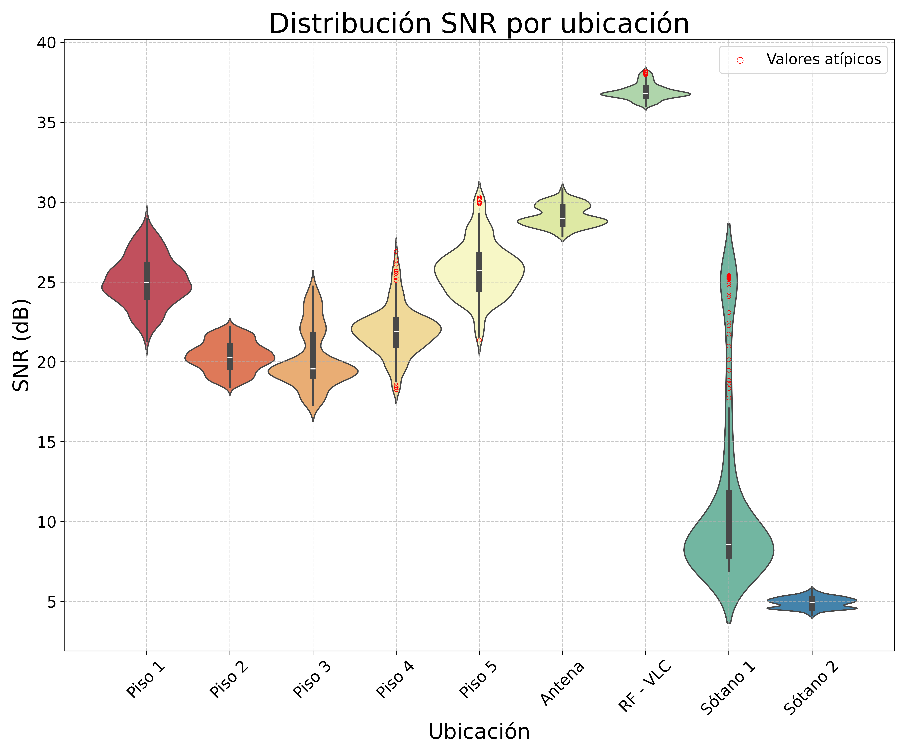
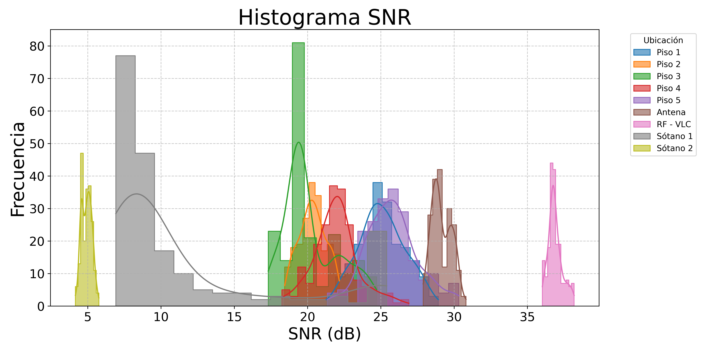
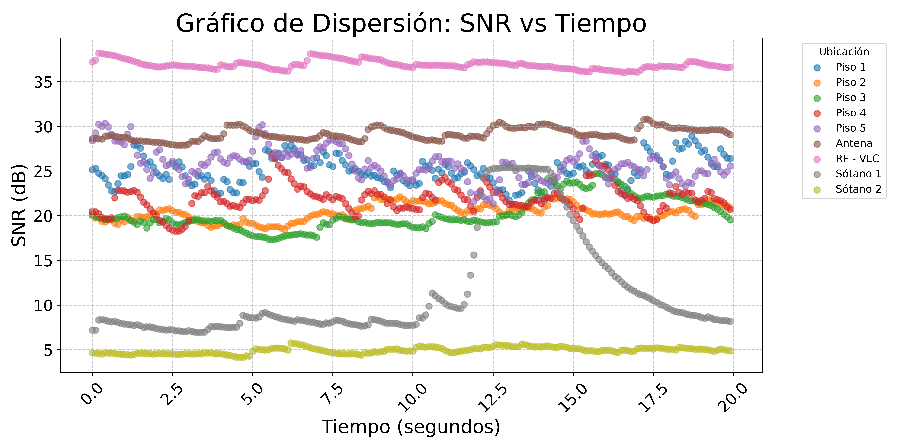
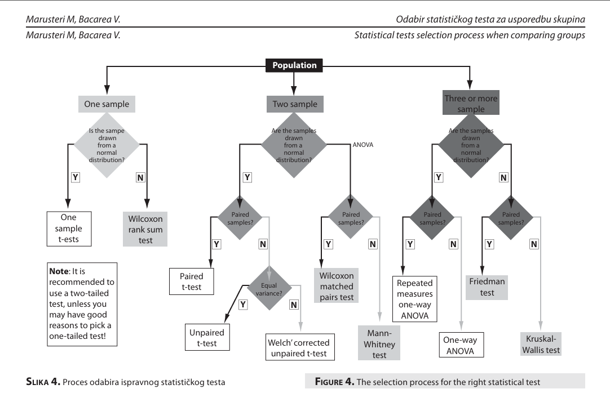
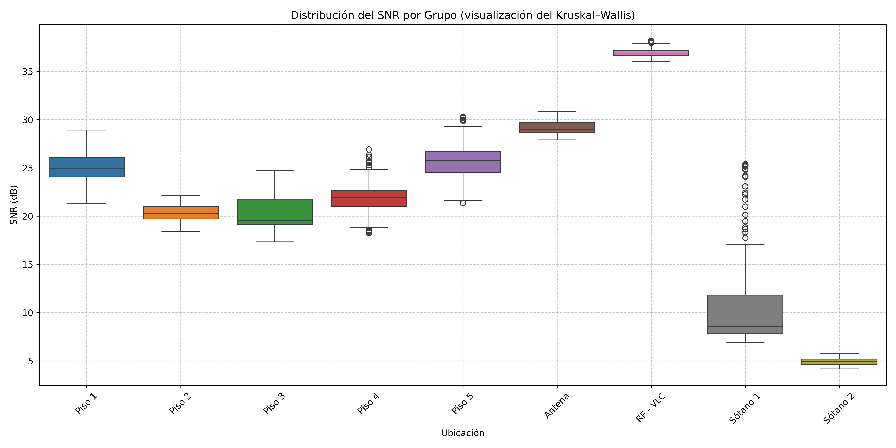

# SNR-Lab

> Estudio estadístico de la degradación SNR en una edificación universitaria del **ITM, Campus Fraternidad (Medellín)** y validación de un banco RF–VLC. Caracteriza el SNR a 103.5 MHz en **9 escenarios** (Antena Yagi outdoor, Pisos 1–5, Sótanos 1–2 y banco RF–VLC) y respalda estadísticamente la **Tabla 4.1** del manuscrito de tesis.

## Estructura del repositorio

| Recurso | Para qué sirve |
|---|---|
| [Data/](Data/) | Archivos `.xlsx` y `.csv` con las 200 muestras de SNR por escenario (9 archivos). |
| [Estudio_Estadistico/](Estudio_Estadistico/) | Notebook reproducible + README con los **bloques de código** listos para Jupyter/Colab. |
| [Estudio_Estadistico/Study_images/](Estudio_Estadistico/Study_images/) | Figuras (PNG/PDF a 600 dpi) y `statistics.csv` generados por el notebook. |
| [DetallesEstadisticos.md](DetallesEstadisticos.md) | Documento de trabajo con justificación metodológica extensa, caracterización física por escenario y propuesta de migración al manuscrito. |

> [!TIP]
> Este README es una **lectura narrativa** del estudio — explica resultados, decisiones y figuras sin código. Para **reproducir el análisis paso a paso** (con los bloques Python listos para pegar en Jupyter/Colab), ver [Estudio_Estadistico/README.md](Estudio_Estadistico/README.md) o abrir directamente [Estudio_Estadistico/SNRDegradationStudy.ipynb](Estudio_Estadistico/SNRDegradationStudy.ipynb).

---

## Alcance del estudio

- Caracterización del SNR a 103.5 MHz (banda FM comercial) en **9 escenarios** del edificio del ITM-Fraternidad.
- Visualizaciones (violín, histograma, scatter temporal) y **tabla de estadísticas descriptivas** con glosario didáctico.
- Análisis inferencial: prueba de **normalidad (Shapiro–Wilk)** y prueba de **comparación entre grupos (Kruskal–Wallis)**, con interpretación de hipótesis nulas.
- Justificación bibliográfica de la cadena estadística mediante el árbol de decisión de **Marusteri & Bacarea (2010)**.

> [!IMPORTANT]
> Los 9 escenarios reportados son **Antena Yagi (Piso 4 outdoor)**, **Pisos 1–5**, **Sótanos 1 y 2**, y banco **RF–VLC**. La antena Yagi se ubica en la zona al aire libre del Piso 4 (no en la terraza del 6º piso), elegida deliberadamente porque está justo encima de los sótanos, lo que permite tender un cable vertical hasta Sótano 2 emulando un trayecto outdoor → indoor profundo.

---

## 1. Datos del estudio

Los **9 archivos** se leen directamente desde la rama `main` del repositorio mediante URLs `raw`, por lo que el notebook funciona en Colab sin clonar nada. Cada escenario aporta **200 filas** (≈ 22 s de adquisición continua a 0.1 s por muestra), totalizando **1.800 muestras** de SNR.

| Archivo | Escenario |
|---|---|
| `Piso1_103_5MHz_SNR.xlsx` … `Piso5_103_5MHz_SNR.xlsx` | Pisos 1 a 5 (indoor, receptor estático en el punto óptimo de cada nivel) |
| `AntennaOutdoor_103_5MHz_SNR.xlsx` | Antena Yagi outdoor (Piso 4, al aire libre) — línea base |
| `RF-VLC_SNR.xlsx` | Banco RF–VLC (laboratorio, condiciones controladas) |
| `Sotano1_103_5MHz_SNR_B.csv` | Sótano 1 (–1) — enfermería + ludoteca |
| `Sotano2_103_5MHz_SNR_E.csv` | Sótano 2 (–2) — laboratorios |

> [!NOTE]
> El receptor de cada sesión es un **AIRSPY**. En cada nivel se hizo un barrido manual previo y, una vez identificado el punto de mejor SNR, el receptor se **fijó** durante la adquisición — la comparación entre niveles es por tanto conservadora (cada piso se compara contra su mejor recepción).

---

## 2. Violin Plot por ubicación

Distribución de SNR por ubicación con boxplot interno y outliers (regla 1.5·IQR) marcados en rojo. Permite ver de un vistazo la **jerarquía** Antena Yagi → Pisos → Sótanos → RF–VLC y los regímenes de dispersión.

---

## 3. Histograma SNR

Histograma con KDE para todas las ubicaciones superpuestas. Hace visible la **separación modal** entre escenarios y la asimetría de los sótanos.

---

## 4. Scatter SNR vs Tiempo

Evolución temporal del SNR (índice sintético cada 0.1 s) por ubicación. Resalta la **inestabilidad temporal** del Sótano 1 frente a la planitud del Sótano 2 y RF–VLC.

---

## 5. Estadísticas descriptivas por ubicación

Para cada uno de los 9 escenarios se calculan estadísticos descriptivos del SNR. Los descriptores se agrupan en dos familias:

- **Tendencia central** (¿dónde "viven" los datos?): media $\bar{x}$, mediana $\tilde{x}$, moda $\hat{x}$.
- **Dispersión** (¿qué tan estables son?): cuartiles $Q_1, Q_3$, IQR, varianza $\sigma^2$, desviación estándar $\sigma$, fronteras de outliers.

> [!TIP]
> Cuando $\bar{x} \neq \tilde{x}$, la distribución es **asimétrica**: la mediana es más informativa porque es robusta a outliers; la media se desplaza hacia la cola larga.

### Tabla 4.1 — Estadísticos por ubicación

| Place    |  Q1 (dB) | Mean (dB) |  Q3 (dB) | IQR (dB) | ↓ Outlier | ↑ Outlier | Std Dev | Median | Mode  | Variance |
|----------|---------:|----------:|---------:|---------:|----------:|----------:|--------:|-------:|------:|---------:|
| Piso 1   | 24.0575  | 25.0679   | 26.0500  | 1.9925   | 22.0792   | 28.0567   | 1.5609  | 24.980 | 25.45 |  2.4363  |
| Piso 2   | 19.6975  | 20.3366   | 21.0025  | 1.3050   | 18.3791   | 22.2941   | 0.9264  | 20.280 | 20.17 |  0.8582  |
| Piso 3   | 19.1375  | 20.2047   | 21.6775  | 2.5400   | 16.3947   | 24.0147   | 1.8457  | 19.565 | 19.21 |  3.4065  |
| Piso 4   | 21.0275  | 21.9264   | 22.6325  | 1.6050   | 19.5189   | 24.3339   | 1.5346  | 21.920 | 21.15 |  2.3550  |
| Piso 5   | 24.5550  | 25.7522   | 26.6800  | 2.1250   | 22.5647   | 28.9397   | 1.7582  | 25.725 | 25.17 |  3.0911  |
| Antena   | 28.6200  | 29.1438   | 29.7100  | 1.0900   | 27.5088   | 30.7788   | 0.6719  | 28.980 | 28.62 |  0.4515  |
| RF - VLC | 36.6200  | 36.8974   | 37.1500  | 0.5300   | 36.1024   | 37.6924   | 0.4790  | 36.810 | 36.62 |  0.2294  |
| Sótano 1 |  7.8750  | 11.5005   | 11.8150  | 3.9400   |  5.5905   | 17.4105   | 5.8970  |  8.565 |  8.26 | 34.7745  |
| Sótano 2 |  4.6100  |  4.9260   |  5.1800  | 0.5700   |  4.0710   |  5.7810   | 0.3421  |  4.935 |  4.57 |  0.1170  |

### Glosario de columnas

| Columna | Símbolo | Definición | Cómo interpretarla |
|---|---|---|---|
| `Place` | **Lugar** | Ubicación física donde se tomó la medida | Identificador del escenario |
| `Q1 {dB}` | $Q_1$ | Primer cuartil (percentil 25) en dB | El 25 % de las muestras quedan por debajo. Marca el límite inferior de la caja del boxplot |
| `Mean {dB}` | $\bar{x}$ | Media muestral en dB | Valor "promedio" del SNR. **Sensible a outliers** |
| `Q3 {dB}` | $Q_3$ | Tercer cuartil (percentil 75) en dB | El 75 % de las muestras quedan por debajo |
| `IQR {dB}` | IQR $= Q_3 - Q_1$ | Rango intercuartílico en dB | **Medida robusta de dispersión**: cuán "ancha" es la mitad central de los datos |
| `Lower Outlier {dB}` | ↓ Atípico | $\bar{x} - 1.5\cdot\text{IQR}$ — frontera inferior | Cualquier muestra por debajo es candidata a outlier (variante de Tukey usada aquí) |
| `Upper Outlier {dB}` | ↑ Atípico | $\bar{x} + 1.5\cdot\text{IQR}$ — frontera superior | Cualquier muestra por encima es candidata a outlier |
| `Std Dev {dB}` | $\sigma$ | Desviación estándar muestral en dB | Dispersión "promedio" alrededor de la media. Mayor $\sigma$ ⇒ canal más inestable |
| `Median {dB}` | $\tilde{x}$ | Mediana muestral (percentil 50) en dB | Valor central robusto. **Mejor descriptor que la media** cuando hay outliers |
| `Mode {dB}` | $\hat{x}$ | Moda muestral en dB | Valor de SNR más frecuente |
| `Variance {dB}` | $\sigma^2$ | Varianza muestral en dB$^2$ | Cuadrado de $\sigma$. **Termómetro de inestabilidad** del canal |

> [!WARNING]
> **Nota sobre la fórmula de outliers:** la regla canónica de Tukey utiliza $Q_1-1.5\cdot\text{IQR}$ y $Q_3+1.5\cdot\text{IQR}$. En este estudio se adoptó la variante centrada en la media ($\bar{x}\pm 1.5\cdot\text{IQR}$). La diferencia es marginal cuando $\bar{x}\approx \tilde{x}$ y se documenta explícitamente para que el lector pueda replicar los cálculos.

---

## 6. Análisis inferencial — Pruebas estadísticas

La estadística **descriptiva** anterior nos dice cómo se ven los datos. La estadística **inferencial** responde dos preguntas formales:

1. **¿Los datos siguen una distribución normal (gaussiana)?** → Determina qué familia de pruebas podemos usar (paramétrica vs. no paramétrica). Lo abordamos con la prueba de **Shapiro–Wilk**.
2. **¿Hay diferencias significativas entre las ubicaciones, o el SNR es estadísticamente "el mismo" en todas?** → Lo abordamos con la prueba de **Kruskal–Wallis**.

### Hipótesis nula ($H_0$) y nivel de significancia

| Comparación | Decisión | Lectura |
|---|---|---|
| $p > \alpha$ | **No se rechaza $H_0$** | Los datos son compatibles con $H_0$. *No "se demuestra"* $H_0$ — solo no hay evidencia suficiente para descartarla |
| $p \le \alpha$ | **Se rechaza $H_0$** | Los datos son **incompatibles** con $H_0$ a nivel $\alpha$. Se acepta $H_1$ |

En este estudio usamos el nivel de significancia estándar **$\alpha = 0.05$** (5 % de probabilidad de "falso positivo").

> [!CAUTION]
> Un p-value pequeño *no* mide "qué tan grande" es el efecto, solo qué tan inverosímil es $H_0$. Por eso, además del p-value, reportamos los descriptores cuantitativos de la Tabla 4.1.

### Justificación bibliográfica: árbol de decisión de Marusteri & Bacarea (2010)

La elección del par de pruebas (**Shapiro–Wilk** seguido de **Kruskal–Wallis**) no es arbitraria: sigue el árbol de decisión de:

> Marusteri, M., & Bacarea, V. (2010). *Comparing groups for statistical differences: how to choose the right statistical test?* **Biochemia Medica**, 20(1), 15–32.

> [!IMPORTANT]
> **Camino que sigue este estudio:**
> 1. **k = 9 ubicaciones independientes** → entrar por la rama "tres o más muestras".
> 2. **Shapiro–Wilk rechaza la normalidad** ($p \ll 0.05$) → bajar por la rama "no normal".
> 3. **Las muestras no son pareadas** (cada ubicación es un punto espacial distinto, sin correspondencia uno-a-uno entre observaciones de grupos diferentes) → el test correcto es **Kruskal–Wallis**.

### Escalado robusto previo: `RobustScaler`

Antes de aplicar Shapiro–Wilk, las features `SNR` y `Time_Index` se escalan con `RobustScaler` (de `sklearn.preprocessing`), que centra los datos en la **mediana** y los escala por el **rango intercuartílico**:

$$x'_i = \frac{x_i - \tilde{x}}{\text{IQR}}$$

| Scaler | Centro | Escala | Robustez a outliers |
|---|---|---|---|
| `StandardScaler` | media $\bar{x}$ | $\sigma$ | **Baja** — un valor atípico desplaza media y desviación |
| `MinMaxScaler` | mínimo $x_{\min}$ | $x_{\max} - x_{\min}$ | **Muy baja** — un único extremo deforma toda la escala |
| **`RobustScaler`** | mediana $\tilde{x}$ | IQR | **Alta** — mediana e IQR son estadísticos robustos |

> [!NOTE]
> Un `StandardScaler` ajustado a estos datos quedaría dominado por la dispersión de Sótano 1 ($\sigma^2 \approx 35$ dB$^2$) y comprimiría los demás escenarios. `RobustScaler` evita ese sesgo y deja los escenarios estables (Antena, RF–VLC, Sótano 2) representados de forma comparable a los inestables.

### 6.1 Test de normalidad: Shapiro–Wilk

| Hipótesis | Afirmación |
|---|---|
| $H_0$ | La muestra **proviene de una distribución normal** |
| $H_1$ | La muestra **no proviene** de una distribución normal |

El estadístico $W$ compara la varianza esperada bajo normalidad con la observada: $W \approx 1$ ⇒ datos normales; $W$ pequeño ⇒ no normales.

> [!WARNING]
> **Resultado obtenido:** $W \approx 0.928$, $p \approx 1.36 \times 10^{-28}$ → **se rechaza $H_0$**: la SNR del estudio **no sigue una distribución normal**.

Esto es coherente con varias señales observadas:

- La presencia de **outliers** en la Tabla 4.1 (columnas ↓/↑ Atípico no triviales en varios escenarios).
- La **asimetría** entre media y mediana en escenarios clave: notablemente Sótano 1 con $\bar{x} = 11.50$ dB vs. $\tilde{x} = 8.56$ dB — una diferencia de casi 3 dB que indica una cola superior larga.
- La presencia de **regímenes físicos heterogéneos** (outdoor con LoS limpio, indoor con multitrayecto, sótanos con shadowing dinámico inducido por personas en movimiento).

> [!IMPORTANT]
> **Implicación:** debemos comparar las ubicaciones con una prueba **no paramétrica** → Kruskal–Wallis.

### 6.2 Test de comparación: Kruskal–Wallis

| Hipótesis | Afirmación |
|---|---|
| $H_0$ | **Todas las medianas son iguales**: $\tilde{x}_1 = \tilde{x}_2 = \dots = \tilde{x}_9$ — la ubicación no tiene efecto sobre la SNR |
| $H_1$ | **Al menos una mediana difiere** — la ubicación sí tiene un efecto medible |

Kruskal–Wallis es la **alternativa no paramétrica al ANOVA de una vía**. Asigna *rangos* a todas las observaciones combinadas y mide la diferencia entre la suma de rangos por grupo y lo esperado bajo $H_0$. Bajo $H_0$, $H$ se distribuye aproximadamente como $\chi^2_{k-1}$ (con $k - 1 = 8$ grados de libertad).

> [!WARNING]
> **Resultado obtenido:** $H \approx 1403.11$ (extremadamente alto frente al valor crítico $\chi^2_{8,\,0.05} \approx 15.51$) y $p \approx 1.20\times 10^{-297}$ → **se rechaza $H_0$ con altísima confianza**.

> [!IMPORTANT]
> **Implicación:** la ubicación **sí** tiene un efecto medible y cuantificable sobre la SNR. La degradación reportada en la tesis no es ruido aleatorio — es un fenómeno físico que el test confirma estadísticamente.

> [!CAUTION]
> **Limitación de Kruskal–Wallis:** la prueba indica que *al menos uno* de los grupos difiere, no cuáles. La inspección visual del violin plot y la lectura directa de la Tabla 4.1 lo comprueban: el contraste **Sótano 1 dinámico vs. Sótano 2 estable** y la jerarquía **Antena Yagi → Pisos → Sótanos → RF–VLC** son visualmente evidentes.

---

## 7. Conclusión estadística

| Pregunta | Respuesta basada en los tests |
|---|---|
| ¿Los datos son normales? | **No** — Shapiro–Wilk: $W = 0.928$, $p \ll 0.05$ → rechazamos normalidad. |
| ¿Hay diferencias significativas entre ubicaciones? | **Sí** — Kruskal–Wallis: $H = 1403.11$, $p = 1.20\times 10^{-297}$ → rechazamos igualdad de medianas. |
| ¿Qué prueba se eligió y por qué? | Kruskal–Wallis, porque tenemos $k>2$ grupos, los datos no son normales, las muestras no son pareadas. Camino validado por el árbol de Marusteri & Bacarea (2010). |
| ¿Qué implica para la tesis? | La degradación SNR observada en la Tabla 4.1 es un **fenómeno estadísticamente significativo**, no aleatorio. Justifica empíricamente la motivación de proponer un sistema híbrido RF–VLC para mitigar la no-uniformidad indoor. |

---

## Reproducibilidad

> [!TIP]
> Todos los bloques de código Python (carga de datos, generación de figuras, pruebas estadísticas) están en [Estudio_Estadistico/README.md](Estudio_Estadistico/README.md) listos para pegar en celdas de Jupyter/Colab, y en el notebook [Estudio_Estadistico/SNRDegradationStudy.ipynb](Estudio_Estadistico/SNRDegradationStudy.ipynb) ya ejecutables. Los datos se leen directamente desde GitHub mediante URLs `raw`, por lo que **no requiere clonar el repositorio**.

Para una justificación metodológica más extensa (caracterización física por escenario, cronograma de adquisición, análisis del shadowing dinámico en Sótano 1 vs Sótano 2, propuesta de migración al manuscrito), ver [DetallesEstadisticos.md](DetallesEstadisticos.md).

---

## Referencias

- **Marusteri, M., & Bacarea, V. (2010).** Comparing groups for statistical differences: how to choose the right statistical test? *Biochemia Medica*, 20(1), 15–32.
- **Pedregosa, F. et al. (2011).** Scikit-learn: Machine Learning in Python. *JMLR*, 12, 2825–2830 (sección sobre `RobustScaler`).
- **Shapiro, S. S., & Wilk, M. B. (1965).** An analysis of variance test for normality (complete samples). *Biometrika*, 52(3/4), 591–611.
- **Kruskal, W. H., & Wallis, W. A. (1952).** Use of ranks in one-criterion variance analysis. *Journal of the American Statistical Association (JASA)*, 47(260), 583–621.
- **Tukey, J. W. (1977).** *Exploratory Data Analysis.* Addison-Wesley.
